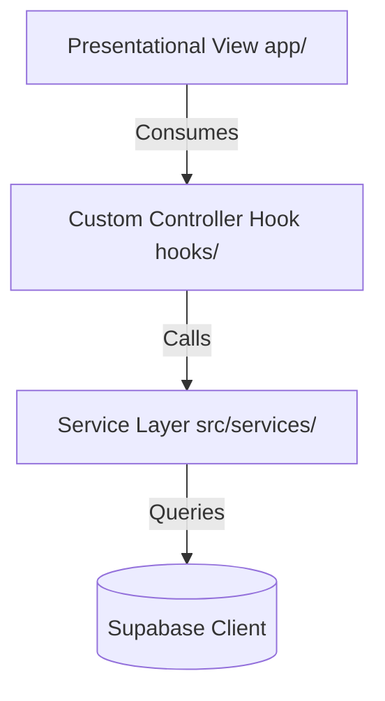

# CampusNest 🏠🎓

CampusNest is a mobile application built with **React Native**, **Expo**, **Expo Router**, **Supabase**, and **TypeScript** designed to connect university/college students with landlords for off-campus housing.

---

## 🌟 Key Features

### 👤 User Roles
- **Students**: 
  - Browse off-campus listings near their university.
  - Search, sort, and filter listings by price, location, and distance.
  - Save/bookmark favorite listings or student posts.
  - Create student posts requesting roommates or specific housing setups.
  - Post and read comments on student request threads.
  - Easily contact landlords directly via email or phone.
- **Landlords**:
  - Publish property listings with details (rent, lease terms, utilities, furnished status, nearby university, move-in date).
  - Select and pin the exact property location on a native map.
  - Upload multiple property photos.
  - Edit or delete active listings.

### 🛡️ Authentication & Profiles
- Role-based signup flows (Landlord vs. Student).
- Secure email authentication backed by Supabase Auth.
- Complete password recovery flows (reset password, verify OTP code, update password).
- User profile management with avatar generation and photo updates.

### 📍 Maps & Location Services
- Mobile-native interactive map integration (`react-native-maps`) with custom marker styling.
- Geocoding services for address lookup and location pinning.

---

## 🏗️ Architecture

CampusNest is built on a clean **decoupled architecture** enforcing strict **Separation of Concerns**:



### 1. Presentational Views (`app/`)
Route screen files under `app/` are purely presentational. They do not maintain complex local state, perform direct API/database fetches, or coordinate routing inside rendering templates. They simply consume variables and actions returned by custom hooks.

### 2. State & Business Logic Hooks (`hooks/`)
All state variables, form validation, image picking integrations, device API bindings (e.g., Clipboard, Phone Linking), and routing coordination are isolated inside dedicated custom hooks (e.g., `useHomeListings`, `useListingDetail`, `useNewPost`).

### 3. Service Layer (`src/services/`)
Communicates directly with the database or third-party APIs. No screen or hook contains direct SQL-like Supabase queries; all fetches, updates, and deletes are routed through dedicated services (e.g., `AuthService`, `ListingService`, `PostService`).

### 4. Global Contexts (`src/context/`)
Implements real-time PostgreSQL database change channels to keep saved lists synced reactively across all screens.

---

## 🚀 Get Started

### Prerequisites
- **Node.js** (v20 or higher recommended)
- **npm** (comes packaged with Node.js)
- **Expo Go** app installed on your physical iOS/Android device (to preview the app)

### Setup Instructions

1. **Clone the Repository** and navigate to the project directory:
   ```bash
   git clone <repository-url>
   cd CampusNest
   ```

2. **Install Dependencies**:
   ```bash
   npm install
   ```

3. **Configure Environment Variables**:
   Create a `.env` file in the root directory:
   ```env
   EXPO_PUBLIC_SUPABASE_URL=your-supabase-project-url
   EXPO_PUBLIC_SUPABASE_ANON_KEY=your-supabase-anon-key
   ```

4. **Start the Development Server**:
   ```bash
   npx expo start
   ```

5. **Run the App**:
   - Scan the QR code displayed in your terminal using the **Camera app** (iOS) or **Expo Go app** (Android).
   - Press `w` to open the app in a web browser.

---

## 🧪 Code Quality & Verification

We enforce clean compilation and code styling standards:

- **Type Checking**: Run TypeScript compiler verification to ensure zero type mismatches:
  ```bash
  npx tsc --noEmit
  ```
- **Linting**: Ensure code satisfies ESLint rules:
  ```bash
  npm run lint
  ```

---

## 🤖 CI/CD Workflow

A GitHub Actions workflow is configured in `.github/workflows/automated_tests.yml` to automatically verify every pull request and push to the `main` branch. The CI runner will:
1. Validate syntax and linting.
2. Run TypeScript build verification.
3. Validate Expo iOS and Android export builds.
